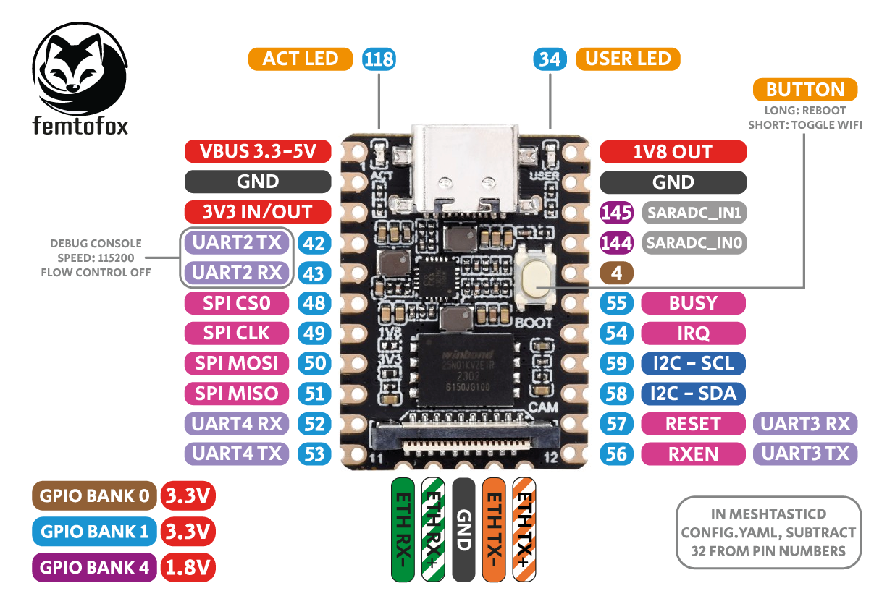

# Femtofox &nbsp;&nbsp;&nbsp;The tiny, low power Linux Meshtastic node
#### The Luckfox Pico Mini is a compact and power efficient Linux capable board, capable of running Ubuntu. Femtofox is an expansion of the Luckfox's capabilities, combining a customized Ubuntu image with a custom PCB, integrating it with a LoRa radio to create a power efficient, cheap and small Meshtastic Linux node.

**Features:**
* Tiny size (63x54mm for the Kitchen Sink Edition, 65x30mm for the Smol Edition). Roughly equivalent to a Raspberry Pi and Pi Zero.
* Power efficiency (~0.35-0.4w) with a 30db radio and no wifi
* Full Linux CLI (Ubuntu) via our pre-built Foxbuntu image
* Meshtastic native client support via SPI
* USB host support
* Wifi over USB
* RTC support

**Accomplished:**
- [x] Meshtastic native client controlling a LoRa radio (see [supported hardware](supported_hardware.md))
- [x] WIFI over USB (see [supported hardware](supported_hardware.md))
- [x] Ethernet over USB (see [supported hardware](supported_hardware.md))
- [x] Ethernet over pins (see *Networking* below and wiring diagram at bottom of page)
- [x] UART communications with Meshtastic nodes (2 pin pairs) such as RAK Wisblock
- [x] USB serial communications with Meshtastic nodes (see [supported hardware](supported_hardware.md))
- [x] USB mass storage
- [x] Real time clock (RTC) support (see [supported hardware](supported_hardware.md))
- [x] Activity LED disabled. User LED will blink for 5 seconds when boot is complete
- [x] Pressing the "BOOT" button triggers reboot
- [x] Ability to reconfigure wifi via USB flash drive
- [x] Meshtasticd to run LoRa radio over SPI (accomplished, updated image and instructions coming soon)
- [x] Allow editing of config files by plugging in thumb drive
- [x] Ability to activate or deactivate WIFI via Meshtastic admin

**Project goals:**
* A solar-deployable Meshtastic node running Linux, without needing a giant solar panel / battery
* Wifi capabilities (with ability to disable/enable wifi via mesh for power savings)

Login for the images is `femto:fox`. Root is `root:root`.

The preconfigured images will reboot every 24 hours. If the internal clock is accurate, this will be at 3am. Reboot timing is set in `crontab`. To keep accurate time, an RTC module can be installed (see [supported hardware](supported_hardware.md)) or internet connectivity can be maintained for NTP. If no authoritative time source is found, time will be set to 2024-01-01 00:00 on boot.

### [Supported hardware - click here](supported_hardware.md)

### Networking:
There are four methods to get online:
1. Ethernet over USB - most adapters should be supported, but I've only tested the RTL8152 chipset.
2. USB wifi  (see [supported hardware](supported_hardware.md)).
3. Preconfigured Ubuntu images: ethernet via the castellated pins at the bottom of the board. See pinout at the bottom of this readme.
4. RDNIS via usb - [see this guide](https://web.archive.org/web/20241006173648/https://wiki.luckfox.com/Luckfox-Pico/Luckfox-Pico-Network-Sharing-1/). Note that in the preconfigured images USB is set to host mode, so you'll have to switch back to peripheral with `sudo luckfox-config`. This is not really recommended, but can be used in a pinch.

### [Installation guide](foxbuntu_install.md)

### Pinout:
|Pin #|Pin ID |Function      |Luckfox |Pin #|Pin ID |Function      |
|-----|-------|--------------|--------|-----|-------|--------------|
|1    |VBus   |5V in/out     |        |22   |1V8    |1.8V out      |
|2    |GND    |              |        |21   |GND    |              |
|3    |3V3    |3.3V out      |        |20   |4C1    |1v8 IO, SARADC|
|4/42 |1B2    |Debug UART2-TX|        |19   |4C0    |1v8 IO, SARADC|
|5/43 |1B3    |Debug UART2-RX|        |18/4 |0A4    |3v3 IO        |
|6/48 |1C0    |CS0, IO       |        |17/55|1C7    |IRQ, IO       |
|7/49 |1C1    |CLK, IO       |        |16/54|1C6    |BUSY, IO      |
|8/50 |1C2    |MOSI, IO      |        |15/59|1D3    |i2c SCL       |
|9/51 |1C3    |MISO, IO      |        |14/58|1D2    |i2c SDA       |
|10/52|1C4    |UART4-TX      |        |13/57|1D1    |UART3-RX, NRST|
|11/53|1C5    |UART4-RX      |        |12/56|1D0    |UART3-TX, RXEN|

Pin ID explanation: **1C6** = GPIO bank **1**, group **C**, pin **6**.
In Meshtasticd's config.yaml we use GPIO bank 1, and subtract 32 from the pin number.

> [!NOTE]
> The information on this page is given without warranty or guarantee. Links to vendors of products are for informational purposes only.
> Meshtastic® is a registered trademark of Meshtastic LLC. Meshtastic software components are released under various licenses, see GitHub for details. No warranty is provided - use at your own risk.
