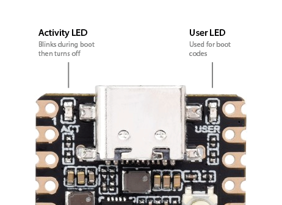

## USB Configuration Tool
To configure some Femtofox settings such as wifi, you can insert a USB flash drive containing a configuration file. On boot, the system will automatically recognize, mount and implement the settings you specify. The tool can also be run from the `femto-config` tool, in the `Utilities` menu.

Configurable settings are:
 - Wifi SSID
 - Wifi PSK (password)
 - Wifi country
 - Timezone
 - Meshtastic:
     - LoRa radio model
	 - [URL](https://meshtastic.org/docs/software/python/cli/#--seturl-seturl) (used to configure LoRa settings and channels)
	 - Security: Add Admin Key
	 - Security: Clear Admin Key List
	 - Security: [Legacy Admin Channel](https://meshtastic.org/docs/configuration/radio/security/#admin-channel-enabled) enable/disable

### Instructions
The USB drive must be formatted with a single FAT32, exFAT, NTFS (read only - log will not be saved to drive) or ext4 partition. Add a file named `femtofox-config.txt` and whichever settings you would like to change (CaSe sEnSiTiVe).

&emsp;&emsp;&emsp;&emsp;			**<a href download="assets/femtofox-config.txt">[Get an example USB configuration file here</a>](assets/femtofox-config.txt)**
```
wifi_ssid="Your SSID name"
wifi_psk="wifipassword"
wifi_country="US"
timezone="America/New_York"
meshtastic_lora_radio="ebyte-e22-900m30s"
meshtastic_url="https://meshtastic.org/e/#CgMSAQESCAgBOAFAA0gB"
meshtastic_admin_key="T/b8EGvi/Nqi6GyGefJt/jOQr+5uWHHZuBavkNcUwWQ="
meshtastic_legacy_admin="true"
dont_run_if_log_exists="true"
```
> [!NOTE]
> Enter as many or as few settings as you like.
> 
> For `wifi_country`, insert your country's [ISO/IEC alpha2 two letter country code](https://en.wikipedia.org/wiki/ISO_3166-1_alpha-2#Officially_assigned_code_elements) (such as US, GB, DE, IN, etc.) in capital letters.
> 
> Use a timezone as it appears in [the tz database](https://en.wikipedia.org/wiki/List_of_tz_database_time_zones).
>
> &emsp;&emsp;**Meshtastic**
> For `meshtastic_lora_radio`, choose your radio from the supported hardware list.
> Options are: 
> * `ebyte-e22-900m30s`
> * `ebyte-e22-900m22s`
> * `ebyte-e80-900m22s` *(experimental)*
> * `heltec-ht-ra62`
> * `seeed-wio-sx1262`
> * `waveshare-sx126x-xxxm`
> * `ai-thinker-ra-01sh`
> * `sx1262_tcxo` *(for Ebyte E22-900M30SM, Ebyte E22-900M22S, Heltec HT-RA62, Seeed Wio SX1262)*
> * `sx1262_xtal` *(for AiThinker RA01SH, and Waveshare Pi hat)*
> * `lr1121_tcxo` *(experimental, for Ebyte E80-900M2213S)*
> * `none` *(for simulated radio)*
>
> Clearing the `meshtastic_admin_key` list: The admin key list can contain up to three keys - *if more are added they will be ignored*. The USB configuration tool supports clearing the admin key list, after which you will need to re-add your admin key/s in a second operation. To clear the admin key list, enter `meshtastic_admin_key="clear"`.

> [!NOTE]
> `dont_run_if_log_exists="true"` will prevent the USB configuration tool from working if there's a log present on the USB drive, indicating it has already been run. There is also an LED boot code for this, described below.

**To apply your configuration, reboot the Femtofox with the USB drive plugged in. No other USB drives can be plugged in at the same time.**
A log (`femtofox-config.log`) is saved to `/home/femto` and the USB drive (except on NTFS, which is read only).
<br>
### Boot codes
When the Femtofox is finished booting, it will blink its User LED (see below) in a pattern which can be used to gather info on its status or help diagnose issues.

| LED blink pattern | Meaning | Possible causes | Solutions |
|--|--|--|--|
|<center>⚠️<br>________________<br>1 very long blink, lasting 5 seconds| Failed to mount USB drive. Ignoring.| <li>Invalid filesystem<li>Corrupted partition table<li>Defective USB drive<li>Defective USB OTG adapter | <li>Use a supported partition (FAT32, exFAT, NTFS, ext4)<li>Repair partition table<li>Try another USB drive<li>Try another USB OTG adapter |
|<center>⚠️<br>\_\_\_\_\_&nbsp;&nbsp;\_\_\_\_\_<br>2 long blinks, each lasting 1.5 seconds | femtofox-config.txt is configured to skip if log exists. | USB drive mounted successfully but femtofox-config.txt contains `dont_run_if_log_exists="true"` and a log is present on the USB drive. Ignoring. | Remove log from USB drive or remove `dont_run_if_log_exists` line from femtofox-config.txt |
|<center>⚠️<br>\_\_\_\_\_&nbsp;&nbsp;\_\_\_\_\_&nbsp;&nbsp;\_\_\_\_\_<br>3 long blinks, each lasting 1.5 seconds | USB drive mounted successfully but femtofox-config.txt was not found. Ignoring.| Config file missing. | Create configuration file as described above. |
|<center>⚠️<br>\_\_\_\_\_&nbsp;&nbsp;\_\_\_\_\_&nbsp;&nbsp;\_\_\_\_\_&nbsp;&nbsp;\_\_\_\_\_&nbsp;&nbsp;\_\_\_\_\_<br>5 long blinks, each lasting 1.5 seconds | USB drive mounted successfully and femtofox-config.txt was found but did not contain readable configuration data. Ignoring.| Configuration file improperly formatted or contains no data. | Check configuration file contents as described above. |
|<center>⚠️<br>\_\_\_&nbsp;&nbsp;\_\_\_&nbsp;&nbsp;\_&nbsp;&nbsp;\_&nbsp;&nbsp;\_\_\_&nbsp;&nbsp;\_\_\_&nbsp;&nbsp;\_&nbsp;&nbsp;\_<br>2 long blinks, each lasting 1 second, then 2 short blinks, each lasting 1/4 of a second. Repeats twice | Error while trying to implement a Meshtastic setting after 3 attempts. Some settings may have been implemented successfully.| <li>The error may be transient.<li>Configuration file may contain improper data. | <li>Try again.<li>Check configuration file contents as described above.<li>Check the log.<br><br>This pattern may flash before other patterns. The pattern will repeat once for each failed setting.|
|<center>✅<br>. . . . . . . . . .<br>10 very fast blinks, each lasting 1/8th of a second | USB drive mounted successfully, and femtofox-config.txt was found and contained configuration data which was sent for deployment. Any affected services will now restart. You can disconnect the USB drive. | This does not mean that the information in the config file is correct - only that it was readable.<br>Note that the "success" boot code will flash if at least one setting is successfully read - even if the setting was not implemented successfully.|
|<center>✅<br>\_\_&nbsp;&nbsp;\_\_&nbsp;&nbsp;\_\_&nbsp;&nbsp;\_\_&nbsp;&nbsp;\_\_<br>5 medium blinks, each lasting 0.5 seconds | Boot complete. Appears on every successful boot and always appears last.| | |
 
> [!NOTE]
> Boot codes can appear in sequence - for example: one long (4 second) blink, followed by 5 medium (half second) blinks means the USB drive failed to mount, and that the boot sequence is complete.
<!--stackedit_data:
eyJoaXN0b3J5IjpbLTE3MzAwMTU5Nl19
-->